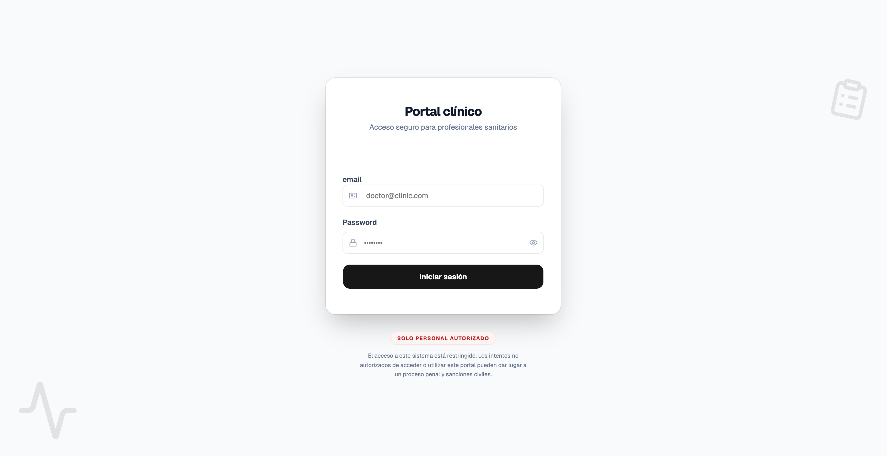
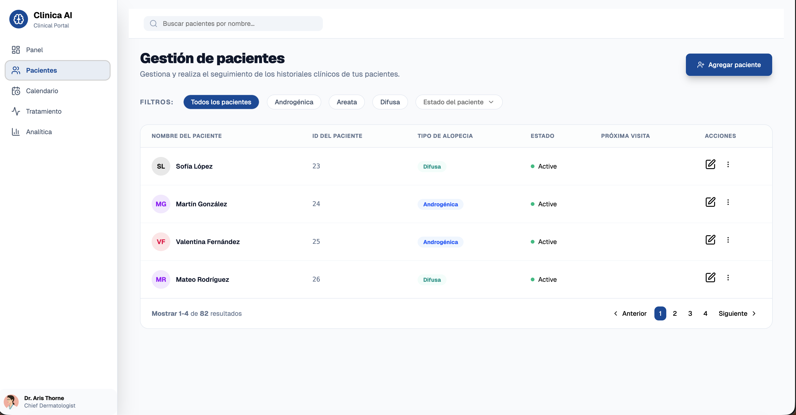
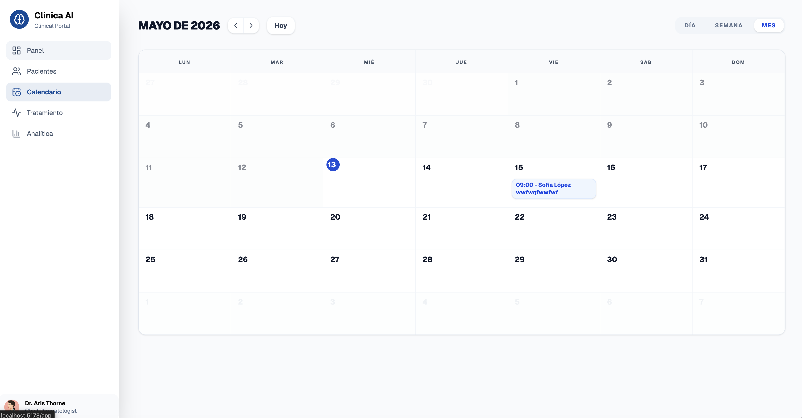

# 🏥 Clínica AI – Plataforma de Gestión Clínica

Aplicación web desarrollada con React + TypeScript + Vite orientada a la gestión clínica y administración de pacientes, citas médicas y seguimiento sanitario.

La aplicación permite autenticación segura de doctores, gestión de pacientes, programación de citas médicas y visualización de información clínica mediante una interfaz moderna, accesible y responsive inspirada en dashboards SaaS profesionales.

El proyecto se centra en:

* Arquitectura modular y escalable
* Autenticación y seguridad mediante Supabase + RLS
* Formularios robustos con React Hook Form + Zod
* Gestión de estado mediante hooks personalizados
* Accesibilidad y semántica HTML
* Diseño responsive con Tailwind CSS + shadcn/ui
* Separación clara entre lógica, UI y servicios

---








---

## 🚀 Tecnologías usadas

- React: 19
- TypeScript
- Vite
- Tailwind CSS
- React Router DOM
- React Hook Form
- Zod
- Supabase
- FullCalendar
- shadcn/ui
- Lucide React
- clsx

---

## 📸 Funcionalidades

- Autenticación segura mediante Supabase Auth
- Protección de rutas privadas
- Gestión de pacientes
- Creación, edición y eliminación de pacientes
- Sistema de citas médicas
- Calendario interactivo con FullCalendar
- Dashboard clínico responsive
- Validación avanzada de formularios con Zod
- Componentes reutilizables y accesibles
- Row Level Security (RLS) para protección de datos médicos
- Sidebar de navegación con rutas protegidas
- Logout seguro con persistencia de sesión

---

## 📂 Estructura del proyecto

```txt
src/
├── components/
│   ├── shared/
│   │   └── FormDialog
│   │   └── ToogleGroupField
│   ├── ui/
│       └── button
│       └── card
│       └── combobox
│       └── dialog
│       └── dropdown-menu
│       └── field
│       └── input-group
│       └── input
│       └── label
│       └── pagination
│       └── select
│       └── separator
│       └── sonner
│       └── spinner
│       └── table
│       └── textarea
│
├── config/
│       └── constants
│       └── navigation
├── features/
│   ├── auth/
│   │   ├── components/
│   │   │   └── LoginForm
│   │   │   └── Logout
│   │   │
│   │   ├── context/
│   │   │   └── AuthContext
│   │   │
│   │   ├── hooks/
│   │   │   └── useAuth
│   │   │
│   │   ├── schemas/
│   │   │   └── loginSchema
│   │   │   └── passwordSchema
│   │   │
│   │   └── services/
│   │       └── auth.service
│   │
│   ├── appointments/
│   │   ├── components/
│   │   │   └── AppointmentForm
│   │   │   │   └── AppointmentForm
│   │   │   │   └── DateTimeSelector
│   │   │   │   └── FormAction
│   │   │   │   └── NotesField
│   │   │   │   └── PatientSelector
│   │   │   └── CalendarEventContent
│   │   │   └── CalendarToolbar
│   │   │
│   │   ├── hooks/
│   │   │   └── useAppointments
│   │   │
│   │   ├── pages/
│   │   │   └── AppointmentsPage
│   │   │
│   │   ├── services/
│   │   │   └── appointments.service
│   │   │
│   │   ├── schema/
│   │   │   └── appointment.schema
│   │   │
│   │   ├── style/
│   │   │   └── calendar
│   │   │
│   │   ├── types/
│   │   │   └── appointment.types
│   │   │
│   │   └── utils/
│   │       └── date.utils
│   │
│   ├── patients/
│       ├── components/
│       │   └── PatientAction
│       │   └── PatientDialog
│       │   └── PatientFilter
│       │   └── PatientForm
│       │   └── PatientRow
│       │   └── PatientPagination
│       │   └── PatientSpinner
│       │   └── PatientsSearch
│       │   └── PatientsTable
│       │
│       ├── hooks/
│       │   └── usePatients
│       │   └── usePatientMutations
│       │
│       ├── pages/
│       │   └── PatientsPage
│       │   └── PatientsHead
│       │
│       ├── schemas/
│       │   └── patient.Schema
│       │
│       ├── services/
│       │   └── patients.service
│       ├── test/
│       │   └── patienDialog.test
│       │   └── patientForm.test
│       │   └── patient.service.test
│       │   └── patientsPage.test
│       │   └── patientsPagination.test
│       │   └── usePatientMutations.test
│       │   └── usePatient.test
│       │
│       └── types/
│       │   └── patient.types
│       └── utils/
│           └── patient.mapper
│           └── patientColors
│
├── layout/
│   ├── AppShell/
│   │   └── AppShell
│   │   └── sidebar
│   │
├── routes/
│   ├── AppRouter
│   └── ProtectedRoute
│
├── shared/
│   ├── services/
│   │   └── supabaseClient
│   │
├── styles/
│   └── style
│
├── types/
│   └── shared
````


## 🗄️ Backend y autenticación

La aplicación utiliza:

Supabase

https://supabase.com/

Para:

* Autenticación de usuarios
* Base de datos PostgreSQL
* Row Level Security (RLS)
* Gestión segura de sesiones

## 🔐 Seguridad implementada

La aplicación utiliza políticas RLS para asegurar que:

* Cada doctor solo pueda acceder a sus pacientes
* Cada doctor solo pueda gestionar sus propias citas
* Las operaciones CRUD estén protegidas mediante auth.uid()

## ⚙️ Variables de entorno

Para ejecutar correctamente el proyecto es necesario crear un archivo:

```bash
  .env
```

en la raíz del proyecto.

Dentro del archivo debes añadir las siguientes variables:

```bash
  VITE_SUPABASE_URL=tu_supabase_url
  VITE_SUPABASE_ANON_KEY=tu_supabase_anon_key
```

## 1️⃣ Clonar el repositorio

```bash
  git clone https://github.com/josep100/sprint8._ecosistema_projectes-evoluci-n-.git
```

## 2️⃣ Acceder al directorio del proyecto

```bash
  cd tu-carpeta
```

## 3️⃣ Instalar dependencias

```bash
  npm install
```

## 4️⃣ Ejecutar la aplicación en desarrollo

```bash
  npm run dev
```

## 🎨 Diseño y arquitectura

La interfaz está inspirada en dashboards clínicos modernos con:

* Diseño tipo SaaS
* Componentes reutilizables
* Arquitectura feature-based
* Separación entre lógica, UI y acceso a datos
* Accesibilidad semántica
